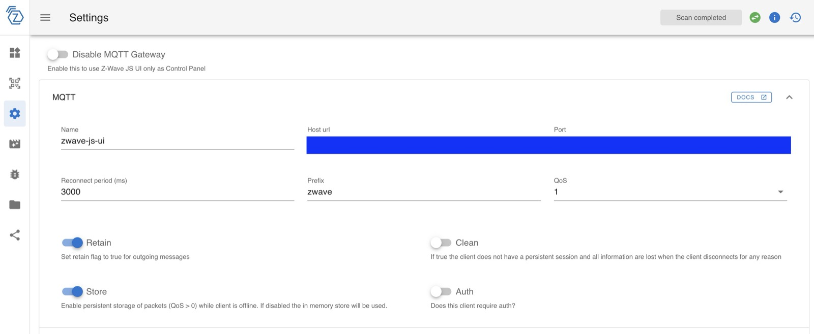
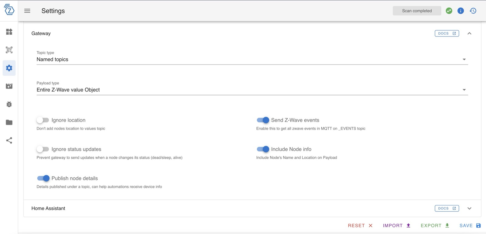

# Z-Wave JS UI

Control your Z-Wave network from Gladys, through [Z-Wave JS UI](https://zwave-js.github.io/zwave-js-ui/)
and an MQTT broker.

This integration does **not** talk to your Z-Wave stick directly. Z-Wave JS UI
owns the radio and the network management (inclusion, exclusion, healing,
firmware updates); this integration turns the nodes it publishes into Gladys
devices, and Gladys commands into Z-Wave commands.

## What you need

1. **Z-Wave JS UI**, running and already paired with your Z-Wave controller.
2. **An MQTT broker** (Mosquitto, EMQX…) reachable from both Z-Wave JS UI and
   Gladys.

## Setting up Z-Wave JS UI

The integration expects MQTT topics named in a specific way. These are not
configurable on the Gladys side: Z-Wave JS UI is the one that must match.

In **Settings**, **MQTT** section:

- **Name**: `zwave-js-ui` — otherwise the prefix of some topics will be wrong;
- **Prefix**: `zwave`;
- **Host url** / **Port**: your broker, plus the username and password if it
  requires them.



Then, in the **Gateway** section, exactly these settings:

- **Topic type**: `Named topics`;
- **Payload type**: `Entire Z-Wave value Object`;
- **Send Z-Wave events**: enabled;
- **Include Node info**: enabled;
- **Publish node details**: enabled;
- **Ignore location** and **Ignore status updates**: disabled.



Without the payload type and the Z-Wave events, no device state ever reaches
Gladys.

## Configuring the integration

In Gladys, open the integration's **Configuration** tab:

1. **MQTT broker URL** — for example `mqtt://192.168.1.10:1883`.
2. **MQTT username / password** — leave empty for an anonymous broker.
3. Save.

Use **Test the connection** to check the link: it reports the broker it reached
and how many Z-Wave nodes it can see.

## Adding your devices

Open the **Discovery** tab: every non-virtual Z-Wave node appears there, with
the features this integration understands. Pick a room, adjust the name, and
create the devices you want. **Scan** asks Z-Wave JS UI for a fresh node list —
useful right after including a new device.

A device you create is populated immediately from the last known values, so it
is not blank while waiting for a battery sensor to wake up.

## Supported devices

Features are derived from the Z-Wave command classes a node exposes:

| Command class                       | What you get in Gladys                                |
| ----------------------------------- | ----------------------------------------------------- |
| Binary Switch                       | on/off switch                                         |
| Multilevel Switch (dimmer)          | brightness, on/off, "restore previous"                |
| Multilevel Switch (window covering) | shutter position, open/close/stop                     |
| Binary Sensor / Alarm Sensor        | motion, smoke, CO, CO₂, leak, opening, temperature    |
| Notification                        | door/window opening, smoke alarm, CO alarm            |
| Multilevel Sensor                   | temperature, illuminance, power                       |
| Meter                               | energy, power, voltage, current                       |
| Central Scene                       | button clicks (single, double, triple, hold, release) |
| Battery                             | level and low-battery flag                            |
| Thermostat Mode                     | mode: off, heat, cool, auto                           |
| Thermostat Setpoint                 | heating, cooling and energy-save setpoints            |
| Thermostat Operating State          | what it is really doing: idle, heating, cooling       |

### Thermostats

A Z-Wave thermostat exposes up to three distinct setpoints — heating, cooling
and energy save — and each becomes its own temperature feature in Gladys. The
**mode** is what the device is asked to do; the **operating state** is what it
is actually doing: a thermostat set to Heat goes idle once the room is warm
enough.

One limitation worth knowing: the Z-Wave "Energy Save Heat" mode has no Gladys
equivalent. It is therefore **reported as Heating** — which is what the device
is doing — but selecting Heating from Gladys switches the thermostat from
energy-save to plain heating. The energy-save temperature itself stays
adjustable through its own setpoint.

The modes offered in the UI are Off, Heat, Cool and Auto. Z-Wave does not
reliably advertise which modes a device supports, so a heat-only thermostat
still shows Cool and Auto, and ignores them.

A node exposing something else still appears in Discovery — only the features
above are created.

## Troubleshooting

**Nothing appears in Discovery.** Check the Configuration tab status. If it
says the broker is unreachable, the URL or the credentials are wrong. If it is
connected but no node shows up, go back over "Setting up Z-Wave JS UI": **Name**
must be `zwave-js-ui` and **Prefix** `zwave`, or the integration listens on
topics nobody publishes to.

**A device stopped updating.** Z-Wave JS UI is the source of truth: check the
node is alive there first.

**"State budget exhausted" in the logs.** Gladys accepts 300 states per minute
per integration. A very chatty network (energy meters reporting every few
seconds) can exceed it: the integration then keeps the first and last value of
each feature and drops the intermediate ones. Reducing the report frequency of
the noisiest devices in Z-Wave JS UI is the real fix.

Set `LOG_LEVEL=debug` for verbose logs, readable from the integration's **Logs**
tab.

## Migrating from the built-in Z-Wave JS UI integration

Gladys ships a built-in `zwavejs-ui` service. This external integration
replaces it and produces the **same devices, features, categories, units and
names**, so your history, scenes and dashboards can follow.

1. Install and configure this integration.
2. In the **Discovery** tab, create the devices matching the ones you already
   have.
3. Migrate each device, which moves its history and rewrites the references in
   your scenes and dashboards. Until the built-in integration is flagged as
   deprecated in Gladys, the migration has no button yet — call the API
   directly, once per device:

   ```
   POST /api/v1/device/<internal-device-selector>/migrate
   {
     "destination_device_selector": "<new-device-selector>",
     "features_mapping": {
       "<source-feature-selector>": "<destination-feature-selector>"
     }
   }
   ```

   Both devices expose the same feature list in the same order, so the mapping
   is one-to-one.

4. Once every device is migrated, disable the built-in integration.

Migrating deletes the source device: do it once you are satisfied with the new
one.
